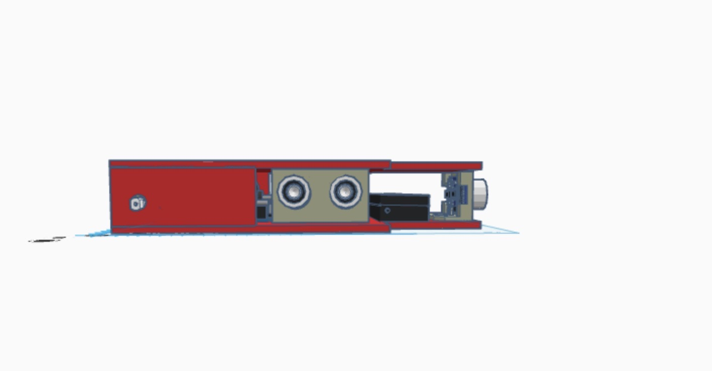
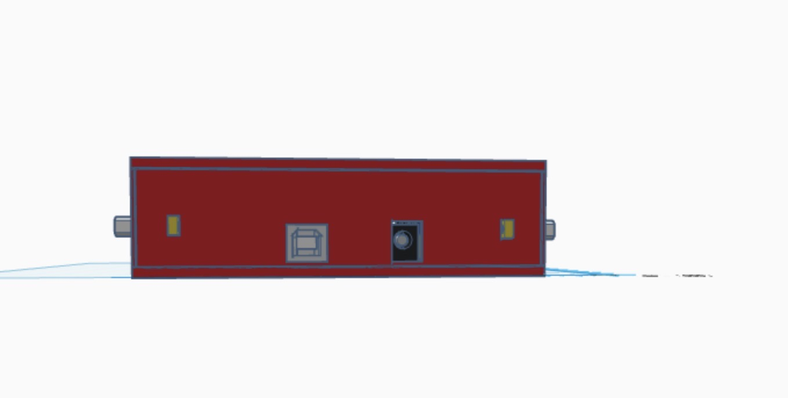
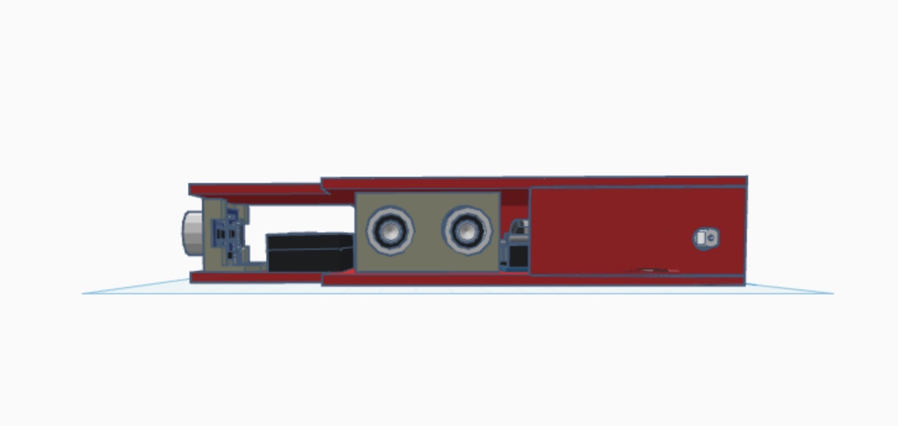
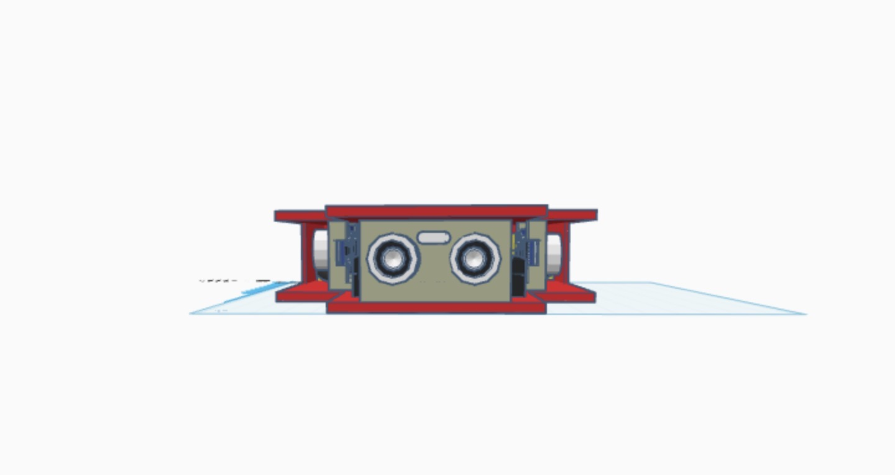
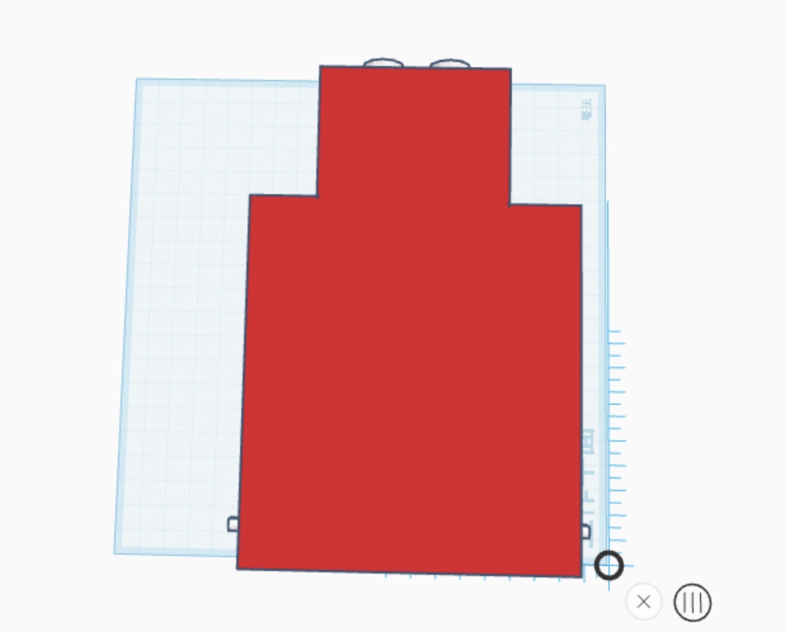

# Foto de diseño 3D

|Lado izquierdo | Lado trasero | Lado derecho |
| - | - | - |
|  |  |  |

| Lado frontal | Desde arriba |
| - | - |
|  |  |

# Objetivo del diseño.

El objetivo de este es que en nuestra clase los alumnos cada uno crea un diseño para robot y elegiremos dos de los mejores par participar en un torneo de robótica.

# Explicación de diseño.

Mi diseño es plano y los diseños son ajustados de tamaño, en el lado frontal lo he recortado los rectangulos para quitarle el peso y que sea más ligero, después en los motores tiene placa puesto para protegerlo y con agujeros para que se pueda poner las ruedas, y por detrás también tiene una placa larga protegiendolo y los huecos que se lo he dejado es para que los enchufes y los cables puedan estar conectados, y yo he tumbado la pila para que no ocupe demasiado sitio sino el diseñovva a ser muy grande, porque yo lo he pensado hacerlo ligero.

# Lista de materiales.

- Dos motores.

- 

