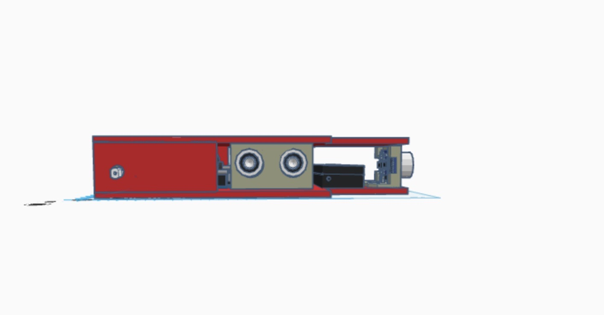
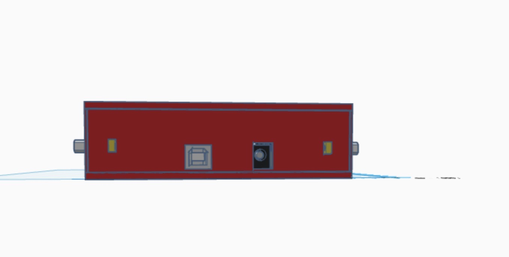
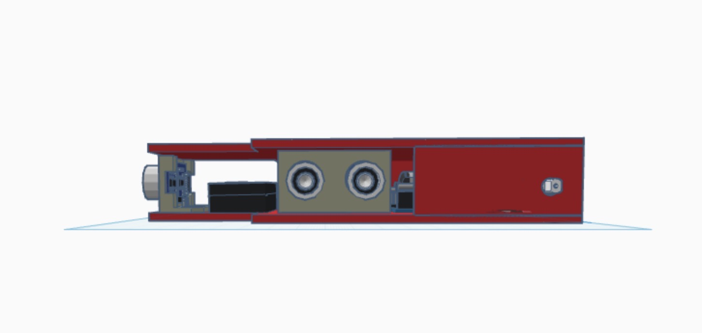
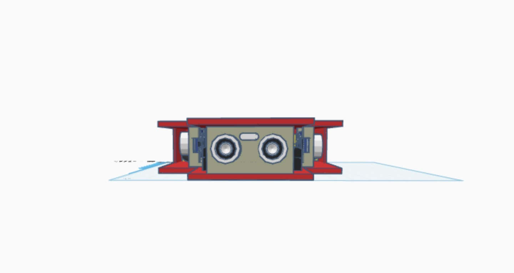
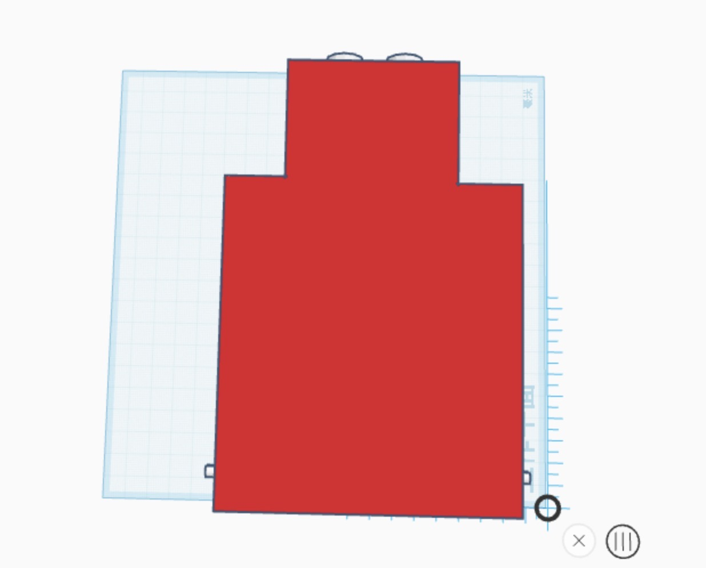
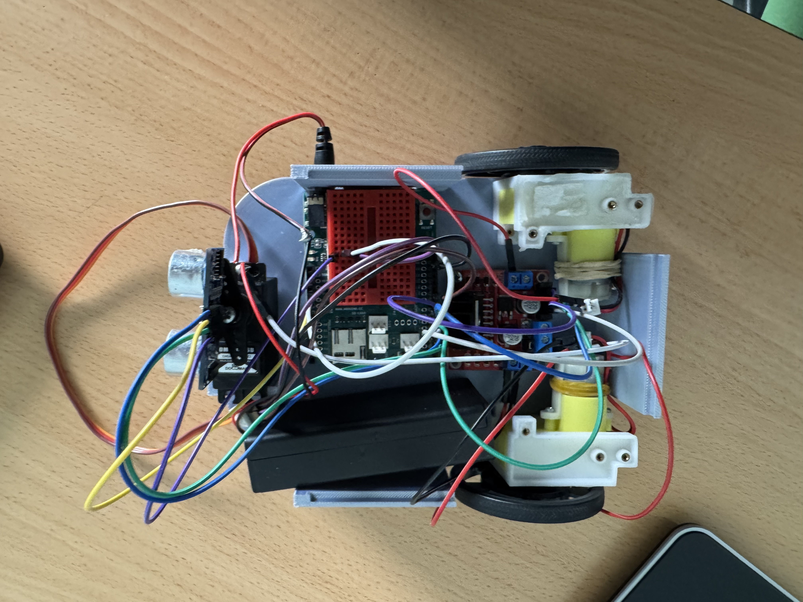
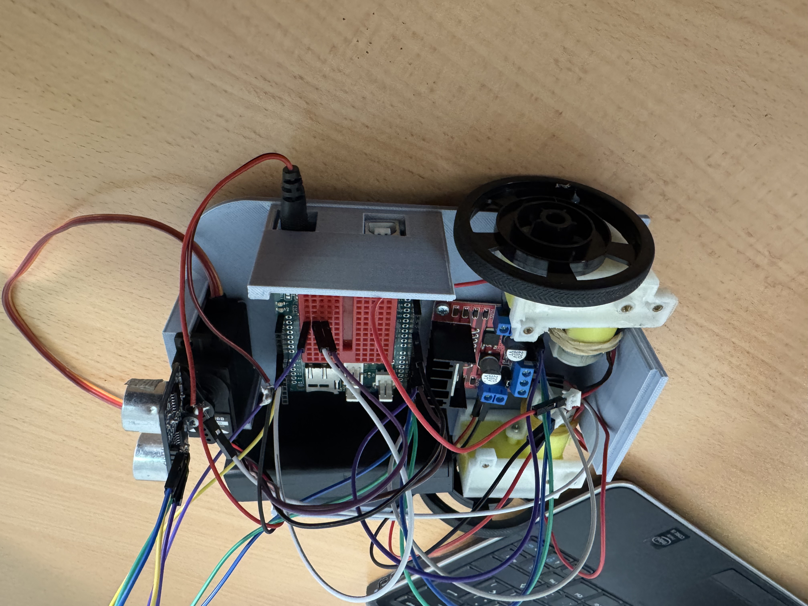

# Foto de diseño 3D

|Lado izquierdo | Lado trasero | Lado derecho |
| - | - | - |
|  |  |  |

| Lado frontal | Desde arriba |
| - | - |
|  |  |

## Objetivo del diseño.

El objetivo de este es que en nuestra clase los alumnos cada uno crea un diseño para robot y elegiremos dos de los mejores par participar en un torneo de robótica.

## Explicación de diseño.

Mi diseño es plano y los diseños son ajustados de tamaño, en el lado frontal lo he recortado los rectangulos para quitarle el peso y que sea más ligero, después en los motores tiene placa puesto para protegerlo y con agujeros para que se pueda poner las ruedas, y por detrás también tiene una placa larga protegiendolo y los huecos que se lo he dejado es para que los enchufes y los cables puedan estar conectados, y yo he tumbado la pila para que no ocupe demasiado sitio sino el diseñovva a ser muy grande, porque yo lo he pensado hacerlo ligero.

## Lista de materiales.

- Dos motores.

- Una bateria.

- Un escudo.

- Tres sensores dee ultrasonido.

- Tres placas para proteger los ultrasonidos.

- Varios placas de diseños.

- un placa arduino.

# Robot laberinto.

| Foto 1 | Foto 2 | Foto 3 |
| - | - | - |
|  |  |  |

## Explicación del robot entero.

Este es el proyecto final de este trabajo, tiene diferencia que el diseño principal y los componentes no son iguales, dentro de la placa estan todos los componentes que hemos usado, el objetivo de este robot es resolver un laberinto y lo voy a explicar a continuación.

__Componentes:__ 2 motores de corriente continua con un sistema reductor de velocidad, 1 escudo(Shield), 1 placa arduino, 1 portapilas con pilas de 18650 de 3,7 voltios cada una, 1 ultrasonido y 1 servomotor.

__Motores de corriente continua con un sistema reductor de velocidad:__ Estos motores estan situados en la parte trasera de la placa de robot, esta atornillado en la placa midiendo la longitud y y la distancia para que encaje justo en la placa para que no se mueva, esta conectados con cuatro cables al escudo, conectado en OUT1, OUT2, OUT3 y OUT4. 

__Shield L298N:__ Esto sirve para que esten todos conectados, que le den suficiente potencia y para controlar los motores. Se puede ver en la imagen esta situado en el centro del robot para que se pueda conectar los cableados a todos los componentes que le necesitan.

__Placa arduino:__ Esto sirve para que el robot funcione, porque en el ponemos el programa y los cableados de programa, sin el el robot no funcionaria. En el imagen podremos ver que esta conectados los cableados a varios si sitios, en este caso esta conectado al ultrasonido, al escudo y a la bateria

__portapilas con pilas de 18650 de 3,7 voltios cada una:__ Esto sirve para que las pilas esten alimentados, que funcionen al usarlo y esta conectado los cableados a la placa arduino. Se puede ver en la imagen, la portapila esta situado en la parte izquierdo del robot y los cableados por encima.

__Servomotor:__ Esto es la base para que el ¨ojo¨ del robot pueda girar hacia un lado y hacia otro, esta situado en la parte delantera del robot, para que tenga una buena visión. Se ve en la imagen que los cableados que uno esta conectado en 5V, uno en un pin( cual quiera) y uno en GND.

__Ultrasonido:__ Esto es como el ¨ojo¨ de robot, funciona en que tira hondas de ultrasonido y rebota para que lo pueda recibir y mandar una señal a la placa arduino. Se puede ver en la imagen tiene los cableados en uno en 5V, dos en pines(la que quiera) y el GND.

