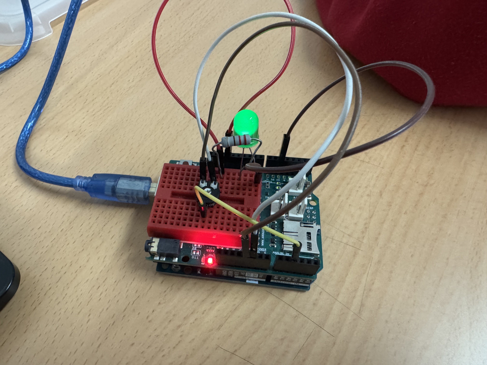
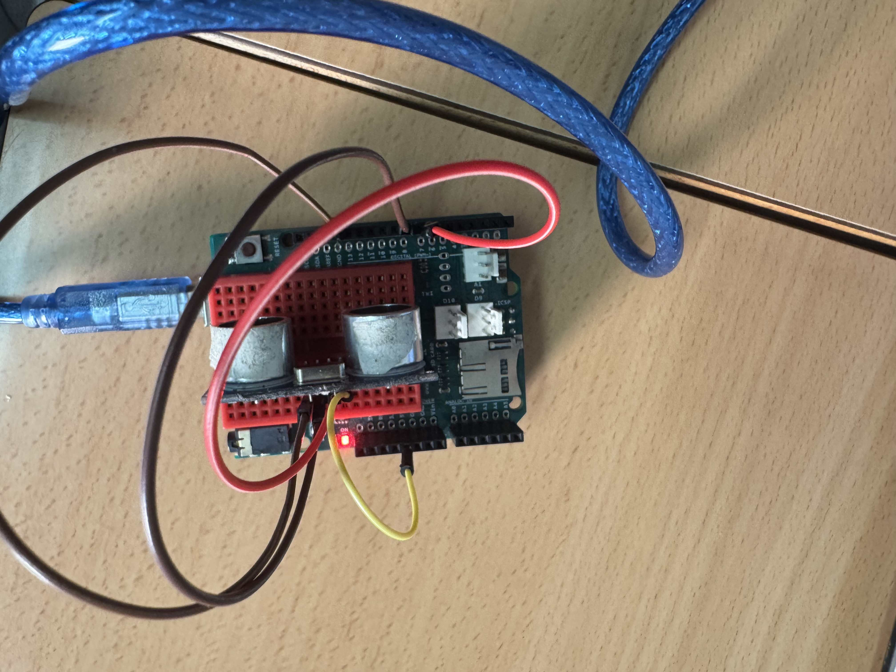
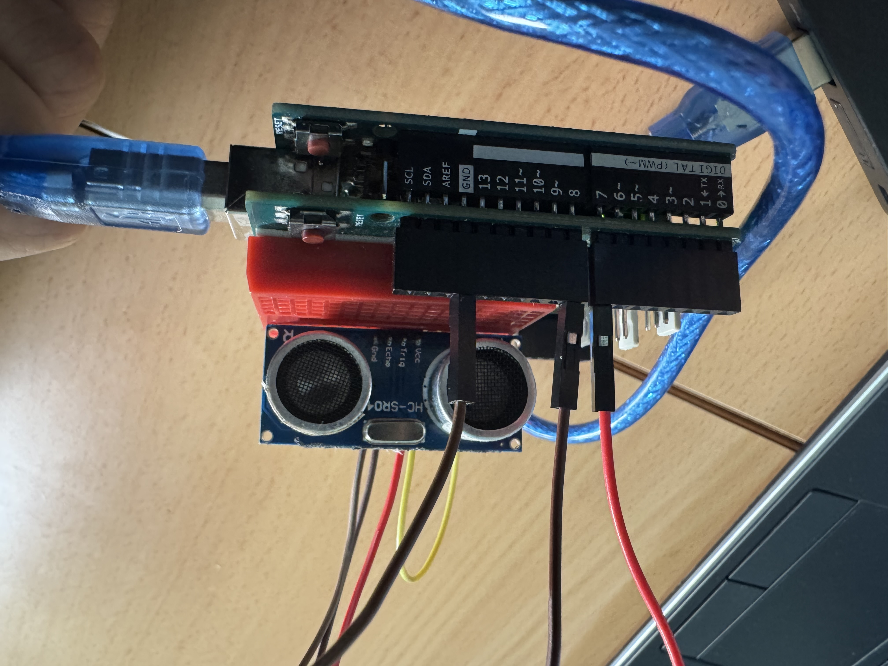
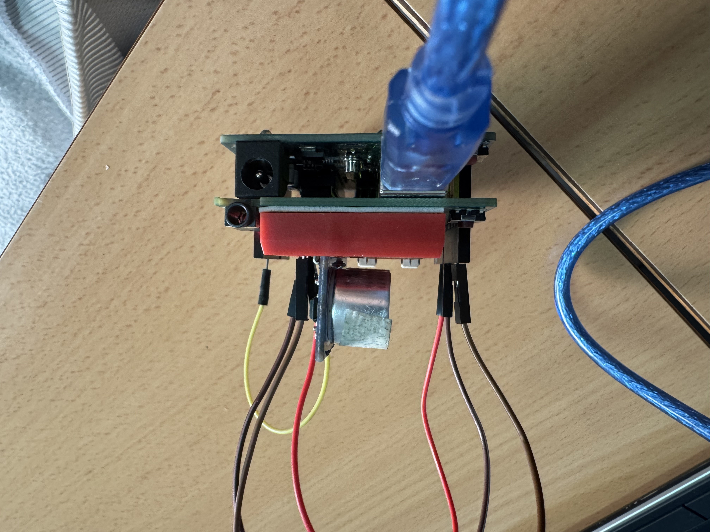
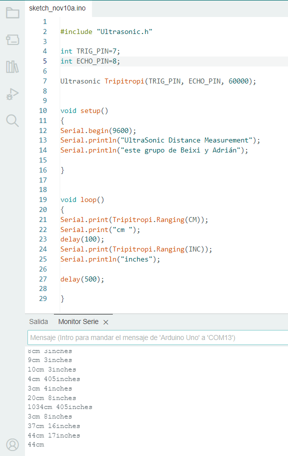

# 1º Foto del circuito de encendido alternativos.

Este es el pantallazo de circuito de arduino, esta dividido en dos placas, uno es la placa de arduino y otro es la placa de prototipado.
La placa de protodipado esta dividido en varios agujeros y estan conectado en cinco en cinco a dirección horizontal.
La placa de arduino es donde ponemos todas las materiales que necesitamos, los dos que parecen bombilla uno de color rojo y el otro de azul se llaman diodo led, tienen dos palillos metálicos que se llaman cátodo y ánodo, el cátodo es negativo y el ánodo es positivo, los dos tienen el cátodo conectado GND ( tierra ) y los ánodos en resistencia de 220 voltios, sabemos que la resistencia es de 220V por su color de rojo rojo y marrón, y por último el otro lado de los dos resistencia tiene que estar conectado en algún pin y asi ya funciona.

# Foto de la programación de circuito.

Mi programa empieza con dos int(esto es la variable) en este caso esta en el 7 y el 8, después sigue con el void setup (funciona en que se ejecuta una sola vez al inicio del programa), dentro de void setup esta el pinmode(terminal7, OUTPUT) y el pinmode(terminal7, OUTPUT), esto es que el 7 y el 8 esta como salida, desùés en seguida esta el void loop (es para crear un bucle), dentro de el está el digitalwrite(terminal7, HIGH) y el digitalwrite(terminal8, LOW), estos significa que un pin digital esta en alto (HIGH) y el otro en bajo (LOW) , y el delay(10) significa que al terminar los anteriores se espera 10 milisegundos y asi sigue la segunda parte pero cambiando el alto y el bajo de sitios(osea si en el anterios es 7 en lato y el 8 en bajo, en este caso es lo contrario, el 7 en bajo y el 8 en alto) y asi termina el programa.

# 2º Foto del circuito de pulsador.

# Foto de la programación de circuito.

# 3º Foto de potenciómetro.

# Foto de programación de circuito.

# 4º Foto de mapeado.

# Foto de prgramación de mapeado.

# 5º Foto de ultrasonido.

# Foto de programación ultrasonido.

